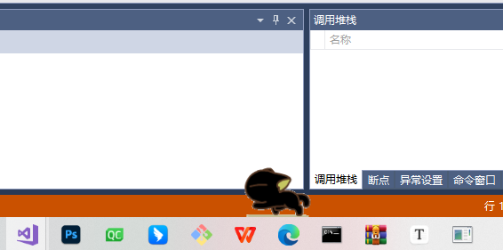
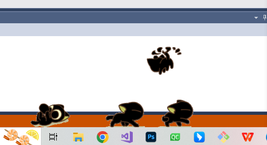
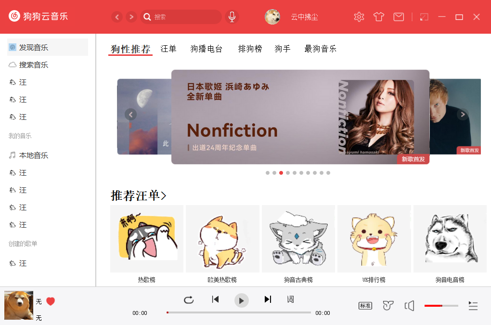

# 桌面宠物

## 介绍

基于QT实现的桌面宠物，目前功能有自由运动，鼠标拖动，悬挂在桌面边界，吃文件等常规操作，并且内置了一个基于网易云API开发的音乐播放器，可以播放网易云音乐（目前有搜索，播放排行榜音乐，播放本地等功能）

## 运行界面

宠物界面

狗狗云音乐界面

## 安装教程

1.git clone git@github.com:yunzhongfuchen/DesktopPet.git

2.使用vs打开

3.重定向（或根据自己本地配置进行修改），编译运行

## 使用方法

1.左键可移动宠物等常规操作，中键删除选中宠物，右键呼出菜单（可以生成多个宠物或打开音乐播放器）

2.播放器基于网易云API，需运行网易云的服务器git@github.com:Binaryify/NeteaseCloudMusicApi.git

## 参考

1：一个半成品网易云界面https://gitee.com/mengxinlearnlinux/cloudmusic-copy

2：网易云API文档：https://binaryify.github.io/NeteaseCloudMusicApi/#/?id=%e5%ae%89%e8%a3%85
