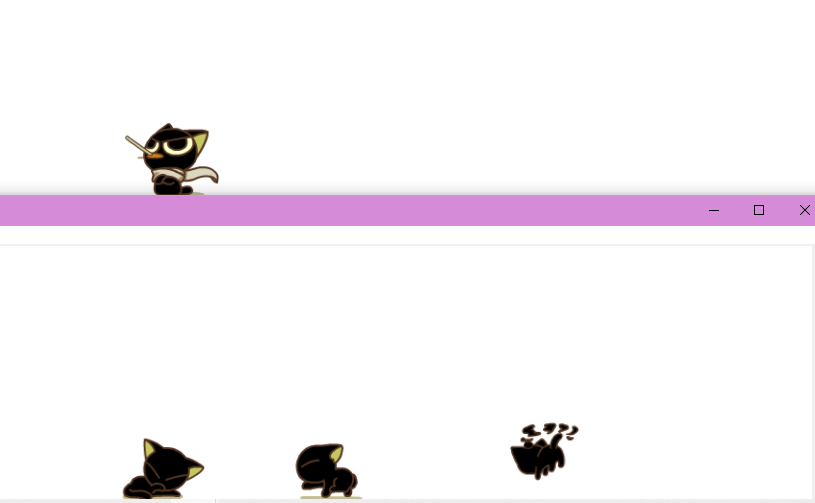
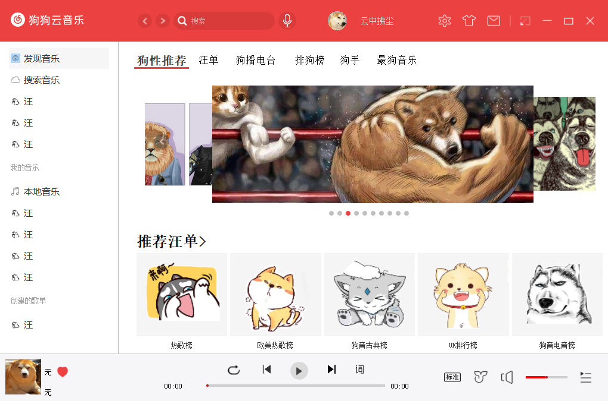

# 桌面宠物

## 介绍

基于QT实现的桌面宠物，目前功能有自由事件，鼠标事件，边界悬挂，文件吞噬，多开宠物，音乐播放等

## 运行界面

宠物界面

1.界面一

2.界面二

## 安装教程

1.git clone git@github.com:yunzhongfuchen/DesktopPet.git

双击 DesktopPet\package 下的”桌面精灵.exe”安装包，进行安装即可

2.git clone git@github.com:yunzhongfuchen/DesktopPet.git

使用vs打开

重定向（或根据自己本地配置进行修改），编译运行

## 使用方法

1.宠物会在桌面下方自由运动

2.有的时候也喜欢待在高处

3.如果你不想让它乱跑，也可以把它挂在边上

4.你有不想要的文件，它也可以帮你吃掉

5.鼠标中键删除宠物

6.鼠标右键打开菜单，里面有很多意想不到但还没开始做的功能

## 音乐播放器链接

https://github.com/yunzhongfuchen/DogMusic
